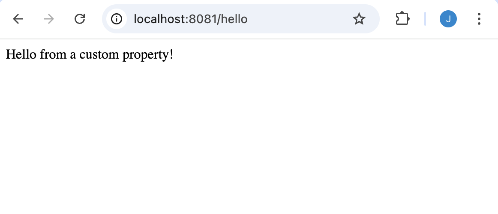
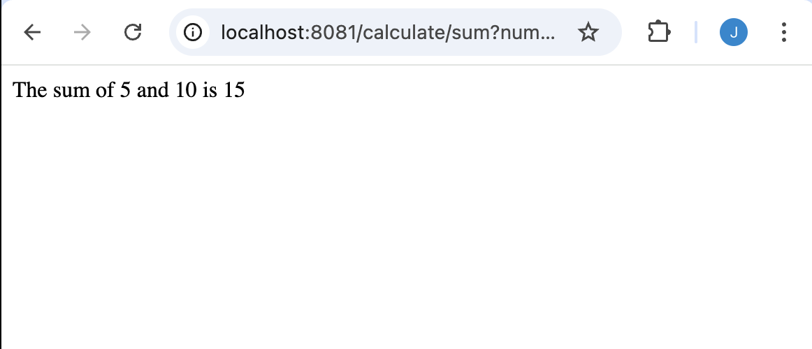
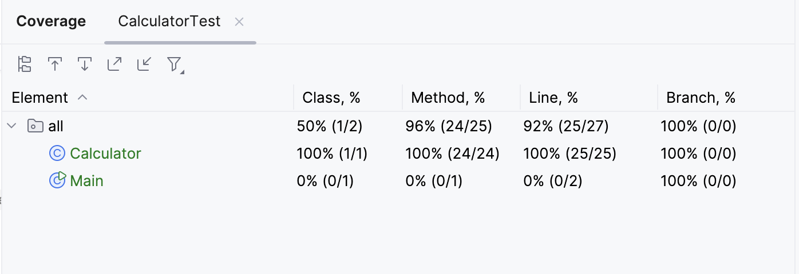

# Joshua Miguel Tuan
## Springboot Crashcourse

### Session 1: Challenge Lab 1

### Challenge Lab 2

### Challenge Lab 3

***

### Session 2: Exercise: Calculator TDD-Style

### Lab 6: Define Your Resource POJO (Product)

### Lab 7: Implement an In-Memory Data Store (Product Repository)

### Lab 8: Create GET All Products Endpoint

### Lab 9: Create GET Product By ID Endpoint

### Lab 10: Create POST Product Endpoint

##
***